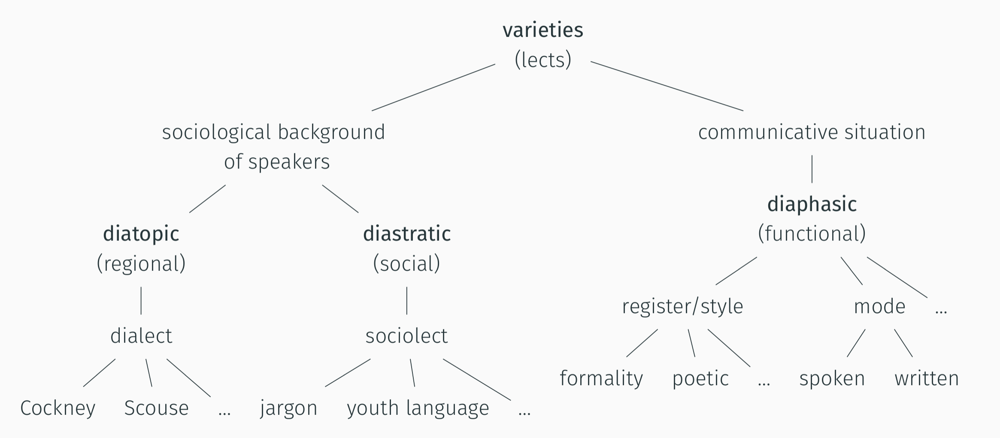

# Lexis and lexical innovation

## Lexical innovation and diffusion

- society continually changes as new practices and products emerge (e.g. smartphones)
- these changes typically first manifest themselves in language on the level of lexis in the form of neologisms (e.g. the words *smartphone* or *iphone*)
- Which recent neologisms can you think of?
- knowledge of words is conventional: speakers learn form-meaning pairings
    - Model of the Linguistic Sign (de Saussure 1916)
        - 

## Theoretical framework

### S-curve model

The S-curve model is relevant to linguistic innovation, diffusion, and language change.

Integration of Milroy's and Rogers' model of diffusion stages into an S-curve. (Kerremans 2015: p. 65)

### The Entrenchment and Conventionalization Model (Schmid 2015, Schmid 2020)

- the more frequently a word is used, the more likely it is
	- that speakers have stored it in their mental lexicon (entrenchment)
	- that it is part of the conventional language system of a language (conventionalization)

- Usage, entrenchment, and conventionalization are interconnected.
	- 
        (p. 4)

### Operationalization

Frequency as an indicator for entrenchment and conventionality (Stefanowitsch and Flach 2017).

- **corpus-as-input:** language used in corpora represents potential exposure to speakers
- **corpus-as-output:** languaged used by speakers in corpora represents potential degrees of entrenchment

### Pathways of diffusion

- types of linguistic variation and diffusion
    - 

- dimensions of diffusion
    - across speakers and communities
    - across text types

- examples for different degrees of diffusion
    - 

# Practice

## Frequency analysis

### Raw frequency

- frequency distribution
    - most frequent
        - 
    - median
        - 
    - least frequent
        - 

### Frequency over time

- using the English Trends (2014–today) corpus
    - example: *blockchain*
        - timeline view
            - 
        - frequency view
            - 
            - 

### Frequency across text types

- using the enTenTen21 corpus
    - example: *alt-right*
        - distribution across `Topic` text type
            - 

## Case study: Lexical innovation

Using the case study words from Würschinger (2021):

- *upskill*
- *hyperlocal*
- *solopreneur*
- *alt-right*
- *alt-left*
- *poppygate*

### Tasks

1. In the English Trends (2014–today) corpus:
    - determine total frequency for each word
        - example for *alt-right*:
            - query: `[lemma="alt-right"]`
            - absolute total frequency: `95,094`
            - relative total frequency: `0.96` per million words/tokens (pmw)
    - identify the year of highest usage
        - sort by year
        - use `Frequency` (raw) and `Relative in text type` (per million words)

2. In the enTenTen21 corpus:
    - determine in which `Genre` each word was used most frequently
        - example for *alt-right*:
            - 

3. Compare results:
    - which words show highest/lowest degrees of conventionality?
    - for which words is there a discrepancy to the results on Twitter?
        - 