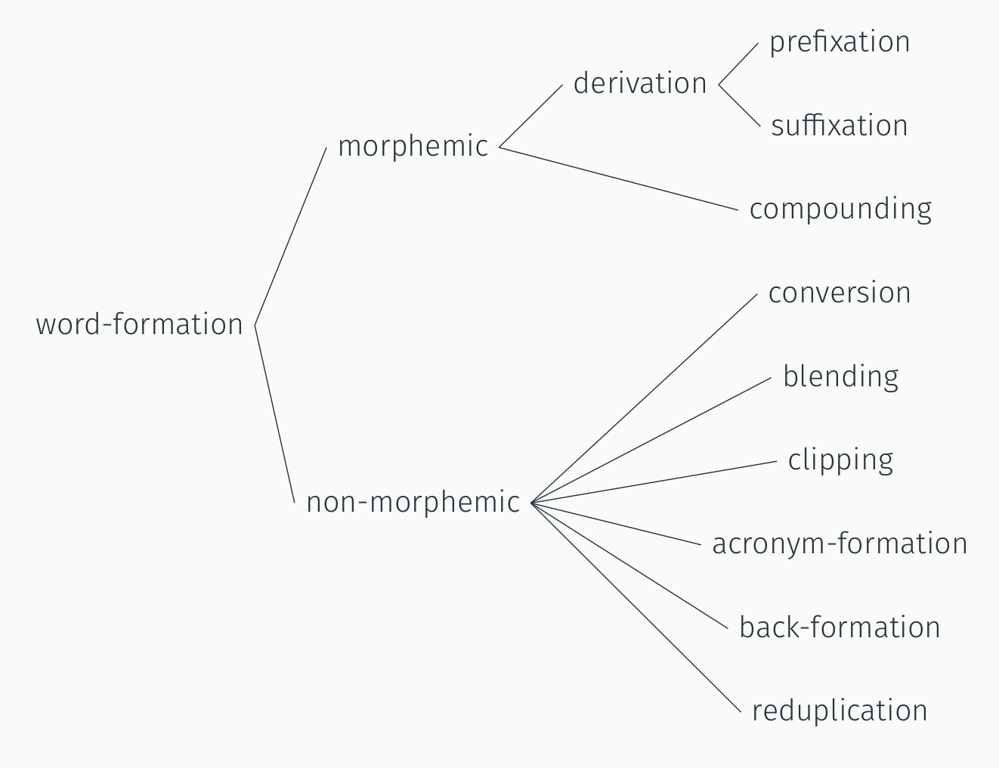
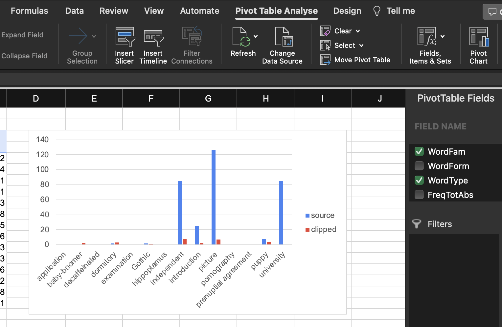

# Fundamentals

- [morphology](morphology) vs [word-formation](word-formation)
    - 
      (Schmid 2016: 15)

# Word-formation processes

## Overview

- 

## Morphemic word-formation

- 

## Non-morphemic word-formation

- overview
    - 
- characteristics
    - 

# Practice: Word-formation analysis

Analyze the word-formation processes involved in the following complex words:

- *childhood*
- *paperback*
- *study-bedroom*
- *foreigner*
- *paleface*
- *Oxbridge*
- *CGEL*
- *fridge*

Example: morphological stemma of *disclaimers*

<!--  -->

# A corpuslinguistic study of clipping (Hilpert 2023)

## Theoretical framework

- Alternative view in previous work: no difference in meaning between source words and clipped forms.
- Authors' framework (Hilpert 2023):
    - Principle of No Synonymy: differences in form imply differences in meaning or use.
    - Usage-based approach: meaning is derived from usage.
    - Distributional hypothesis: words that occur in similar contexts tend to have similar meanings.

## Data and method

- Dataset of clippings:
    - 
- Corpus data from large web corpora.
- Method:
    - Analysing meaning based on:
        - Collocations
        - Word embeddings
    - Investigating variation across text types and semantic differences.

# Practice: Corpus-based analysis of clippings 

## Using Sketch Engine

In the enTenTen21 corpus:

- determine frequency for source words and clipped forms
- example: `[lemma="brother" & tag="N.*"]`
- record absolute and relative frequency

## Data analysis and visualisation in Excel

- Collect results in our [collaborative spreadsheet](https://1drv.ms/x/c/9a2ec97d593520f9/EUTCO_cFjKVEpeihXicUzVgBV1atwKkLYkR1IeWuof85bA)
- Make a local copy of the sheet.
- Analyse results:
    - Insert `Table` for range of data.
        - 
    - Insert `Pivot Table` for `Table`.
        - 
    - Set `Rows`, `Values`, and `Columns`.
        - 
        - Remove `Grand Total` by right-click → remove.
    - Insert `Pivot Chart`.
        - 

### Potential further analyses for clippings

- In the English Trends (2014–today) corpus:
    - analyze frequency over time
    - identify patterns of usage
- Are there differences in usage across text types? (e.g. using COCA or enTenTen)
- Studying long-term diachronic trends using [english-corpora.org](https://www.english-corpora.org):
    - NOW corpus (News on the Web)
    - COCA (Corpus of Contemporary American English)

# Further Study: Semantic Analysis of Clippings with Sketch Engine

## Studying semantics using collocations

### Retrieving occurrences

- Run a query to retrieve all occurrences and get a concordance view (e.g., `[word="brother"]`).
    - 
- Click on the collocation analysis icon.

### Running collocation analysis

- Configure the analysis:
    - 
        - Specify context window range (words to the left/right).
        - Select statistical measures.
- Results:
    - 
        - Examine statistical measures for collocates.

## Studying semantics using word sketches

### Word sketch for single forms

- Generate a word sketch (e.g., for *bro*).
    - 
        - Specify word class if necessary.
- Results provide syntactic contexts:
    - 
        - Visualise results using the built-in tool.
            - 

### Word sketch comparison

- Compare the source word (e.g., *brother*) with the clipped form (e.g., *bro*).
    - Run comparison:
        - 
            - Specify word class.
    - Results show shared and unique collocates/contexts:
        - 
    - Inspect collocations in detail:
        - 
        - Results might reveal specific semantic nuances or homonymy (e.g., *BrO* for Hypobromite).
            - 

### Guiding questions for analysis

- What is the general semantic signature of the source word?
- What is the general semantic signature of the clipped form?
- In what ways do they differ semantically (e.g., stylistic or social characteristics, formality)?
- Do they tend to be used in different contexts (syntagmatic profile) even if their core denotational meaning is similar?
- Does the clipped form have a more narrow or specific scope of meaning?

# Further reading

- Schmid, Hans-Jörg. 2016. *English Morphology and Word-formation: An Introduction*. Berlin: Schmidt.
- Hilpert, Martin. 2023. "Meaning and Usage of Clipped Words in English." *Corpus Linguistics and Linguistic Theory*.
