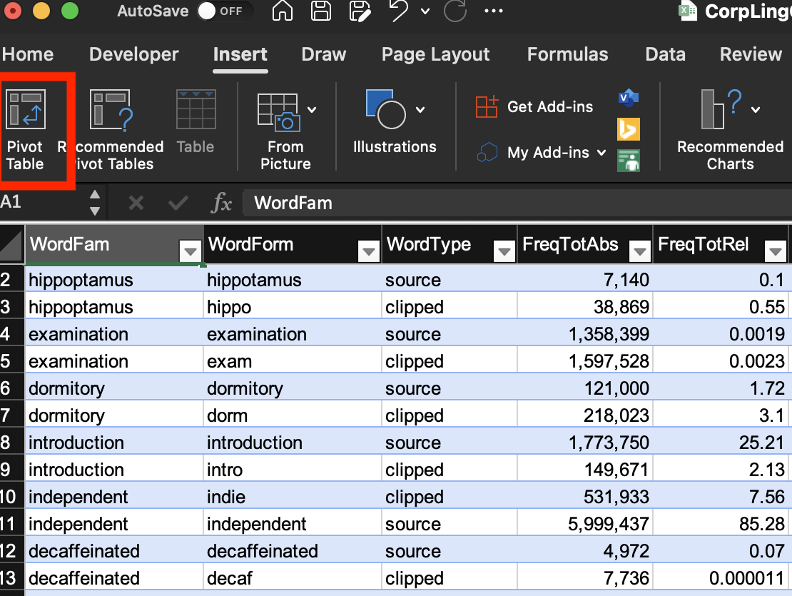
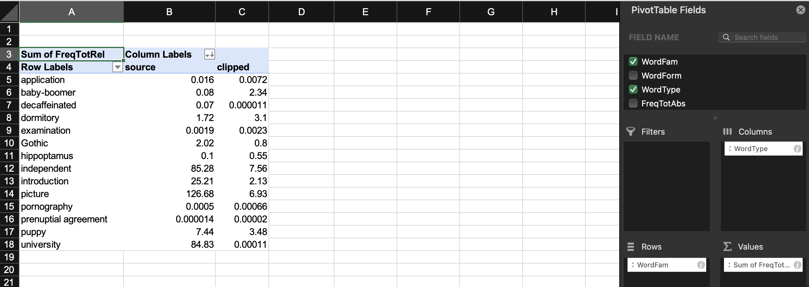

# A corpuslinguistic study of clipping (Hilpert 2023)

Hilpert, Martin, David Correia Saavedra & Jennifer Rains. 2023. *Meaning Differences between English Clippings and Their Source Words: A Corpus-Based Study*. *ICAME Journal* 47 (1): 19–37. <https://doi.org/10.2478/icame-2023-0002>

## Research questions

> “This paper uses corpus data in order to study English clippings such as *dorm* (< *dormitory*), *memo* (< *memorandum*), or *quake* (< *earthquake*), which are formed on the basis of existing lexical items from which phonological material is deleted. More specifically, we investigate meaning differences between clippings and their source words. Are there semantic or pragmatic differences between pairs such as dorm and dormitory, and if so, what are they? Is it possible to formulate generalisations that capture how clippings and their source words relate to one another with regard to meaning? How should these relations be described?” (Hilpert et al., 2023, p. 19)

## Abstract

> This paper uses corpus data and methods of distributional semantics in order to study English clippings such as *dorm* (< *dormitory*), *memo* (< *memorandum*), or *quake* (< *earthquake*).

> We investigate whether systematic meaning differences between clippings and their source words can be detected.

> The analysis is based on a sample of 50 English clippings.

> Each clipping is represented by a concordance of 100 examples in context that were gathered from the *Corpus of Contemporary American English* (COCA).

> We compare clippings and their source words both at the aggregate level and in terms of comparisons between individual clippings and their source words.

> The data show that clippings tend to be used in contexts that represent involved text production, which aligns with the idea that clipped words signal familiarity with their referents.

> It is further observed that individual clippings and their source words partly diverge in their distributional profiles, reflecting both overlap and differences with regard to their meanings.

> We interpret these findings against the theoretical background of *Construction Grammar* and specifically the *Principle of No Synonymy*.

## Theoretical framework

Based on Hilpert, Correia Saavedra & Rains (2023), *Meaning Differences between English Clippings and Their Source Words*, *ICAME Journal* 47 (1): 19–37.

### Meaning of clippings

> “At one extreme of the continuum, the semantic distance between the two is thought to be minimal, or even non-existent. For example, Dressler (2000: 4) argues that abbreviations and clippings such as *GOP* (< *Grand Old Party*) or *mic* (< *microphone*) do not, as a matter of principle, change the meaning of their source words. Clippings and their source words are thus viewed as mutual alternatives that only differ in form.” (Hilpert et al., 2023, p. 20)

### The principle of no synonymy

> “The present paper adopts a view of clippings and their meanings that owes its general orientation to what Goldberg (1995: 67) has termed the *Principle of No Synonymy*. That principle holds that a difference in linguistic form will always indicate a difference in meaning, either with regard to semantic aspects or concerning discourse-functional characteristics of the form in question. We thus work with a broad notion of meaning that includes information-structural, discourse-functional and interpersonal aspects, among other facets of linguistic meaning and function.” (Hilpert et al., 2023, p. 21)

> “A prediction that follows from the Principle of No Synonymy is that in authentic language use, clippings and their source words should have distinct distributional characteristics that reflect their functional differences. In line with usage-based theories of language (Bybee 2010), we adopt the position that language use shapes and reflects speakers' knowledge of language.” (Hilpert et al., 2023, p. 21)

### Distributional hypothesis

> “We further subscribe to what is known as the *distributional hypothesis* (Firth 1957; Turney & Pantel 2010), which holds that the meaning of words is reflected in their contextual elements in language use. Words that appear in similar contexts can be shown to share aspects of their meanings.” (Hilpert et al., 2023, p. 21)

> “For example, the words *cardiovascular* and *hypertension*, which are semantically related, appear in contexts that share many common collocates such as heart, disease, diabetes, stroke, and others.” (Hilpert et al., 2023, p. 22)

> “In this paper, we use corpus data from the COCA (Davies 2008) to compare clippings and their source words (e.g. cardio vs cardiovascular) in terms of their distributional behaviour. We present evidence to suggest that there are tangible differences between clippings and their source words, and that despite a fair amount of semantic overlap, it is reasonable to maintain that once a clipping has established itself in language use, speakers will treat it as a separate lexical element.” (Hilpert et al., 2023, p. 22)

## Data

Sample of 50 English clippings and their corresponding source words.

> “For each clipping and each source word, we retrieve corpus data from the COCA (Davies 2008), which serves as the basis for our analyses.” (Hilpert et al., 2023, p. 19)

## Method

Collocation analysis to investigate semantic profiles across contexts

Word embeddings to compare distributional profiles across text types and individual clippings

## Results

### Variation across text types

### Semantic differences

Differences in collocations for *cardio-vascular* vs *cardio*

# Practice: frequency analysis of clippings

## Using Sketch Engine

1. open the *BNC 2014 Spoken* corpus
2. determine frequency for source words and clipped forms (e.g. `[word="brother" & tag="N.*"]`)
3. record absolute and relative frequencies

## Data analysis and visualisation in Excel

- collect results in our [collaborative spreadsheet](https://1drv.ms/x/c/9a2ec97d593520f9/EUTCO_cFjKVEpeihXicUzVgBV1atwKkLYkR1IeWuof85bA)
- make a local copy of the sheet
- insert `Table` for the data range
    
- insert `Pivot Table`
    
- set `Rows`, `Values`, `Columns`
    
    remove `Grand Total`
- insert `Pivot Chart`
    

### Potential further analyses

- frequency over time in the *English Trends (2014–today)* corpus
- frequency by text type in *enTenTen21* or COCA
- long-term diachronic trends via [english-corpora.org](https://www.english-corpora.org): NOW, COCA

# Practice: semantic analysis with Sketch Engine

## Collocation analysis

1. run a query for the source word or clipping (e.g. `[word="brother"]`)
   
2. click the collocation analysis icon
3. configure:
    - `1`: window range (words to the left/right)
      
    - `2`: statistical measures
4. interpret the results:
   

## Word sketches

### Single forms

1. generate a word sketch for a clipped form (e.g. *bro*); specify the word class
   
2. examine syntactic contexts
   
3. visualise results
   

### Comparison

1. compare source words and clipped forms (e.g. *brother* vs *bro*); specify the word class
   
2. review shared and unique collocates
   
3. inspect collocations in detail
   
4. note any homonymy (e.g. *BrO* as *hypobromite*)
   

# Guiding questions

- What is the general semantic signature of the source word?
- What is the general semantic signature of the clipped form?
- In what ways do they differ (stylistic, social, formality)?
- Do they occur in different syntagmatic contexts despite similar denotation?
- Does the clipped form have a narrower scope of meaning?

# Further reading

- Schmid, Hans-Jörg. 2016. *English Morphology and Word-formation: An Introduction*. Berlin: Schmidt.
- Hilpert, Martin, David Correia Saavedra & Jennifer Rains. 2023. 'Meaning Differences between English Clippings and Their Source Words'. *ICAME Journal* 47 (1): 19–37.